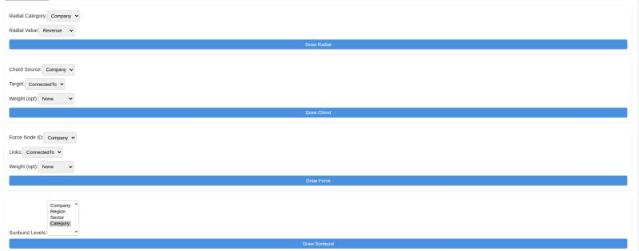

# 📊 Interactive D3.js Data Visualization Dashboard

This interactive dashboard empowers users to effortlessly visualize and explore their flat JSON data through a suite of advanced D3.js charts. Designed for intuitive data exploration, it supports dynamic field detection, coordinated brushing & linking, and a responsive layout.



---

## ✨ Features

* **Dynamic JSON Upload:** Upload any flat JSON file (array of objects) directly from your local machine.
* **Four Advanced D3.js Visualizations:**
    * **Radial Bar Chart:** Visualize the **distribution** of a numeric field across various categories.
    * **Chord Diagram:** Illustrate **relationships and flows** between entities based on an array-typed field.
    * **Force-Directed Graph:** Display **network connections** and their relationships from an array-typed field.
    * **Sunburst Chart:** Explore **hierarchical structures** by selecting multiple categorical levels, providing a drill-down experience.
* **Brushing & Linking:** Clicking on an element in one chart **intuitively highlights** corresponding data points across all other visualizations, ensuring a cohesive analytical experience.
* **Responsive Layout:** Built with CSS Grid and card styling to adapt seamlessly to various screen sizes and devices.

---

## 🚀 How to Run Locally

Getting this dashboard up and running on your local machine is quick and easy!

1.  **Clone the Repository:**
    ```bash
    git clone [https://github.com/YourUsername/your-repo-name.git](https://github.com/YourUsername/your-repo-name.git)
    cd your-repo-name
    ```
    (Replace `YourUsername` and `your-repo-name` with your actual GitHub details.)

2.  **Open in VS Code:**
    ```bash
    code .
    ```

3.  **Start Live Server:**
    * If you don't have it, install the [Live Server extension](https://marketplace.visualstudio.com/items?itemName=ritwickdey.LiveServer) for VS Code.
    * Right-click on `index.html` in the VS Code file explorer.
    * Select **"Open with Live Server"**. Your browser should automatically open the dashboard.

4.  **Load Your Data & Visualize:**
    * Click the **"Choose JSON File"** button to upload your flat JSON data.
    * In each chart's control panel, select the desired data fields.
    * Click the corresponding **"Draw"** button to generate the visualization.

---

## 📂 Folder Structure

The project is organized logically for clarity and maintainability:
```
project-root/
├──  data/                       #  (Optional) Placeholder for sample JSON files
├──  js/
│    ├──  dashboard.js            #  Core logic for dynamic field detection, data parsing, and coordination
│    ├──  radial_bar.js           #  Module for the Radial Bar Chart visualization
│    ├──  chord.js                #  Module for the Chord Diagram visualization
│    ├──  force_directed.js       #  Module for the Force-Directed Graph visualization
│    └──  sunburst.js             #  Module for the Sunburst Chart visualization
├──  index.html                  #  Main HTML structure of the dashboard
├──  style.css                   #  Global styles for layout and appearance
└──  README.md                   #  This documentation file
```

---

## 📝 Assumptions & Notes

* **JSON Data Format:** The uploaded JSON file **must be a flat array of objects**. Nested objects are only supported when they represent leaf values within hierarchical (Sunburst) fields.
* **Array-Typed Fields:** Fields intended for the **Chord** and **Force-Directed Graph** visualizations must be of an array type.
* **Numeric Weights:** Numeric fields are optionally used as weights for certain visualizations (e.g., node size, link strength).
* **Pure D3.js:** No third-party charting libraries were used; all visualizations are built exclusively with **D3.js v7**.

---

## ⚙️ Technical Challenges & Decisions

This project presented several interesting technical hurdles, leading to robust design choices:

* ### Dynamic Field Detection & Classification
    **Challenge:** Automatically understanding the nature of user-uploaded data to enable appropriate visualization choices.

    **Solution:** A custom inspection mechanism that analyzes the first row and a sample of the entire dataset. This allows for intelligent classification of each column as `numeric`, `categorical`, `array`, or `object`, powering the dynamic field selection dropdowns.

* ### Coordinated Brushing & Linking
    **Challenge:** Ensuring seamless, interactive highlighting across disparate D3.js chart modules.

    **Solution:** Implementation of a **single `d3.dispatch` event bus**. This central dispatch system enables each visualization module to emit and listen for selection events, facilitating synchronized highlighting and filtering across the entire dashboard without tight coupling.

* ### Responsive Layout Design
    **Challenge:** Creating a dashboard that maintains usability and aesthetics across a variety of screen sizes.

    **Solution:** Leveraging **CSS Grid** for the primary layout structure combined with flexible **card styling**. This approach ensures that charts and control panels adapt gracefully to different viewport widths, providing an optimal user experience on desktops, tablets, and mobile devices.

---
